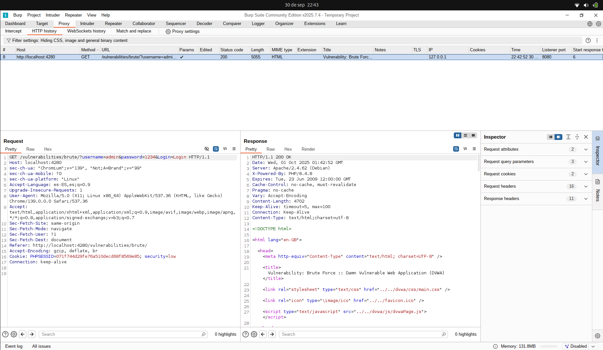
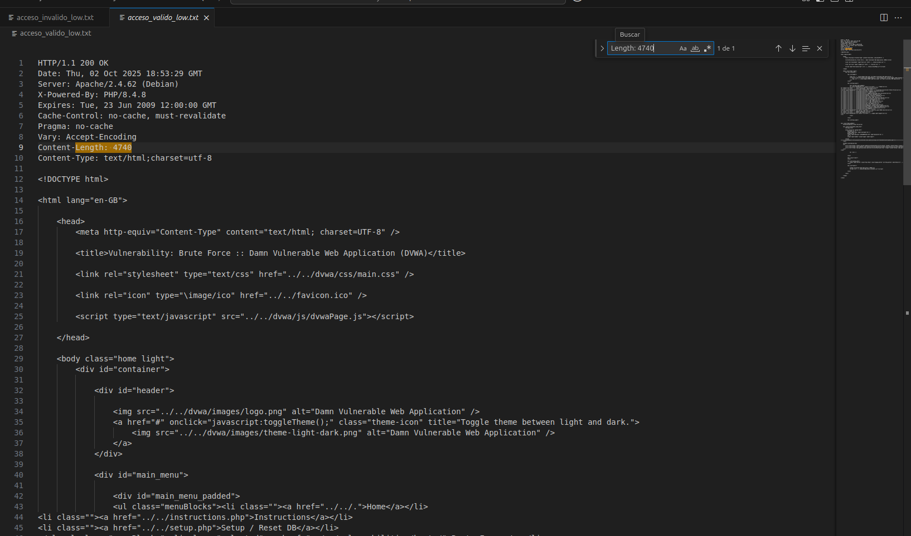
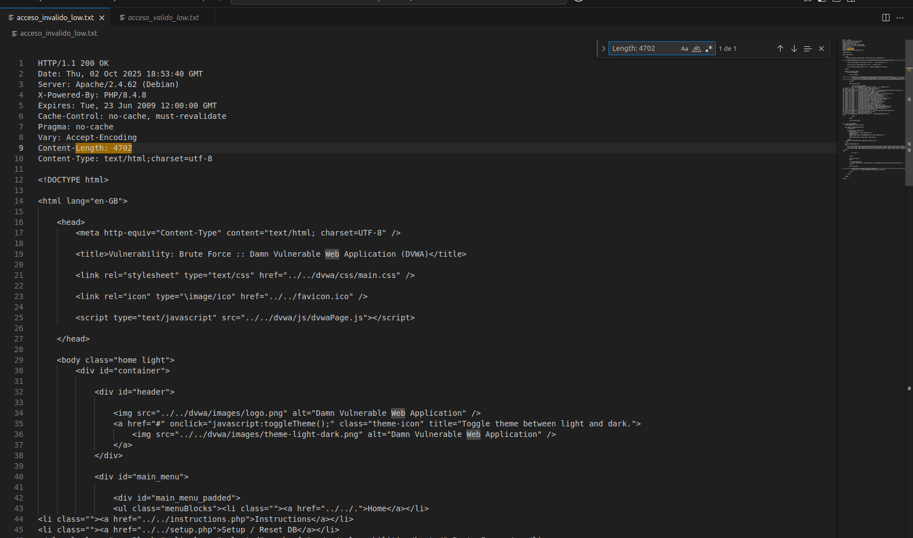
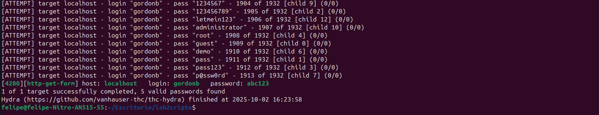

# Informe Laboratorio 2 – DVWA (Damn Vulnerable Web App)

**Autor:** Felipe Cuevas  
**Fecha:** Octubre 2025  
**Correo:** felipe.cuevas1@mail.udp.cl

---

## Descripción del laboratorio

En este laboratorio se realizaron pruebas de seguridad web sobre la aplicación vulnerable **DVWA**, específicamente sobre el módulo de **Brute Force**. Las herramientas empleadas fueron:

- Docker (para desplegar DVWA)  
- Burp Suite (proxy y ataque de fuerza bruta)  
- cURL (accesos válidos e inválidos)  
- Hydra (ataque de fuerza bruta automático)  
- Python (`requests`) para script de fuerza bruta  

Se obtuvieron resultados en forma de credenciales válidas, análisis de tráfico y comparación de herramientas.

---

## Contenido del repositorio

```

  ├─ levantamiento.png
  ├─ redireccion.png
  ├─ consultaproxy.png
  ├─ campos2.3.png
  ├─ prompt.png
  ├─ usuariosdiccionario.png
  ├─ passworddiccionario.png
  ├─ par1.png
  ├─ par1v2.png
  ├─ par1response.png
  ├─ par2.png
  ├─ par2v2.png
  ├─ par2response.png
  ├─ login.png
  ├─ php.png
  ├─ usodecurl.png
  ├─ welcome.png
  ├─ accesoinvalido.png
  ├─ lengthinvalido.png
  ├─ Lengthvalida.png
  ├─ hydracredencialn1.png
  ├─ gordonb.png
  ├─ hydracredencialn2.png
  └─ 1337.png

Docker-compose.yml  
usuarios.txt  
passwords.txt  
hydra_results.txt  
acceso_valido_low.txt  
acceso_invalido_low.txt  
script_bruteforce.py
```

---

## Procedimiento resumido

### 1. Despliegue de DVWA con Docker

```bash
git clone https://github.com/digininja/DVWA.git
cd DVWA
sudo docker-compose up -d
sudo docker ps
```

- Contenedores: `db` (MySQL) y `dvwa` (Apache + PHP)  
- Acceso: [http://localhost:4280](http://localhost:4280)  


---

### 2. Obtención de consultas con Burp Suite

- Configuración de proxy y navegador  
- Captura de petición GET al formulario de login  
- Identificación de campos: `username` y `password`  
- Generación de diccionarios con IA  
- Ejecución de ataque Intruder → obtención de pares válidos:

| Usuario | Contraseña |
|---------|------------|
| 1337    | Charley    |
| pablo   | letmein    |



---

### 3. Accesos válidos e inválidos con cURL

```bash
curl -i --cookie "security=low; PHPSESSID=<ID>" \
"http://localhost:4280/vulnerabilities/brute/?username=pablo&password=letmein&Login=Login" > acceso_valido_low.txt

curl -i --cookie "security=low; PHPSESSID=<ID>" \
"http://localhost:4280/vulnerabilities/brute/?username=pablo&password=pablito&Login=Login" > acceso_invalido_low.txt
```

Diferencias clave entre respuestas:

- Mensaje de autenticación  
- Imagen de perfil del usuario  
- Tamaño del contenido (Content-Length)  
- Inclusión del nombre de usuario en HTML  

  


---

**Nota importante:** en las pruebas con **Hydra**, **cURL** y **Python** se usó la cookie de sesión `PHPSESSID` de una sesión iniciada previamente en la página de login de DVWA (antes de llegar al formulario de ataque de fuerza bruta). **Es necesario reemplazar el valor de `PHPSESSID` (`<ID>`) en los comandos y scripts por el valor real obtenido desde el navegador** antes de ejecutar las pruebas.

---

### 4. Ataque de fuerza bruta con Hydra

Instalación en Linux:

```bash
sudo apt install hydra
```

Ejecución:

```bash
hydra -L usuarios.txt -P passwords.txt localhost http-get-form \
"/vulnerabilities/brute/:username=^USER^&password=^PASS^&Login=Login:H=Cookie:security=low;PHPSESSID=<ID>:F=Username and/or password incorrect" \
-V -s 4280 -o hydra_results.txt
```

Credenciales obtenidas:

| Usuario  | Contraseña |
|----------|------------|
| gordonb  | abc123     |
| 1337     | charley    |



---

### 5. Script de fuerza bruta en Python

- Librería: `requests`  
- Itera sobre listas de usuarios y contraseñas  
- Mantiene sesión con cabecera `Cookie`  
- Detecta respuestas válidas comparando contenido HTML  

**Comando para ejecutar el script (usar los archivos `usuarios.txt` y `passwords.txt`):**

```bash
python3 fuerzabruta.py usuarios.txt passwords.txt
```

### 6. Comparación de herramientas

| Herramienta | Ventajas | Desventajas |
|------------|----------|-------------|
| Burp Suite | Preciso, analiza tráfico, permite modificar peticiones | Lento en ataques masivos |
| cURL       | Rápido, control manual | Laborioso para pruebas múltiples |
| Hydra      | Muy rápido, ataques concurrentes | Detectable por WAF, menos control |
| Python     | Flexible, personalizable | Rendimiento intermedio |

---

## Métodos de mitigación de fuerza bruta

1. Limitación de intentos de login  
2. Captchas o validaciones humanas  
3. Bloqueo temporal de cuentas tras múltiples fallos  
4. Uso de autenticación multifactor (2FA)

---

## Referencias

- DVWA: [https://github.com/digininja/DVWA](https://github.com/digininja/DVWA)  
- Burp Suite Community: [https://portswigger.net/burp/communitydownload](https://portswigger.net/burp/communitydownload)  
- Hydra: [https://github.com/vanhauser-thc/thc-hydra](https://github.com/vanhauser-thc/thc-hydra)
